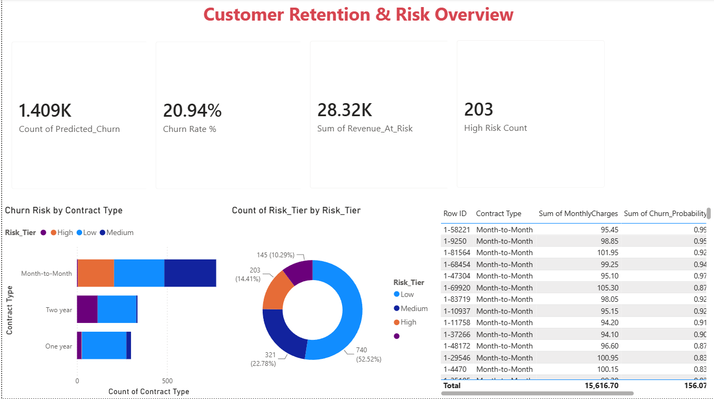

# E-Commerce Customer Retention & Value Optimization Engine

An end-to-end churn prediction pipeline that scores customers by churn risk and prioritizes retention outreach by revenue impact — built in Python, visualized in Power BI.

## Problem

Customer churn is expensive, but not all churned customers cost the same. This project identifies **which customers are likely to churn** and **how much revenue is at stake**, so retention efforts can be targeted rather than blanket.

## Dataset

[Telco Customer Churn](https://www.kaggle.com/datasets/blastchar/telco-customer-churn) (Kaggle, IBM sample dataset) — ~7,000 customers, 21 features covering demographics, account info, and services subscribed.

## Approach

1. **Data cleaning** — handled missing/blank `TotalCharges` values, dropped identifier columns, one-hot encoded categorical features.
2. **Modeling** — trained a Random Forest classifier to predict churn probability (not just a binary label) for each customer.
3. **Evaluation** — accuracy, confusion matrix, classification report, and ROC-AUC (more reliable than accuracy alone given ~27% class imbalance).
4. **Feature importance** — ranked the strongest predictors of churn.
5. **Value scoring** — combined each customer's churn probability with their `MonthlyCharges` to calculate a `Revenue_At_Risk` score, and bucketed customers into Low/Medium/High risk tiers.
6. **Dashboard** — exported scored predictions to Power BI to translate model output into an executive-facing view: KPI summary, risk breakdown by contract type, and a prioritized "who to call first" table.

## Results

- **Model:** Random Forest Classifier
- **ROC-AUC:** 0.824
- **Top churn drivers:** Total Charges, tenure, Monthly Charges, Electronic Check payment method, Fiber Optic internet service
- **Key insight:** Month-to-month contract customers make up the largest share of high-risk churn, compared to one- and two-year contracts.

## Dashboard Preview



## Repo Structure

```
churn_prediction_model.ipynb    → Python notebook (data prep, model, evaluation)
churn_retention_dashboard.pbix  → Power BI dashboard file
dashboard_screenshot.png        → dashboard preview image
README.md
```

## Tools

Python (pandas, scikit-learn, matplotlib, seaborn) · Power BI Desktop

## Next Steps

Potential extensions: hyperparameter tuning, comparing against a logistic regression baseline, SHAP values for individual customer explanations.
